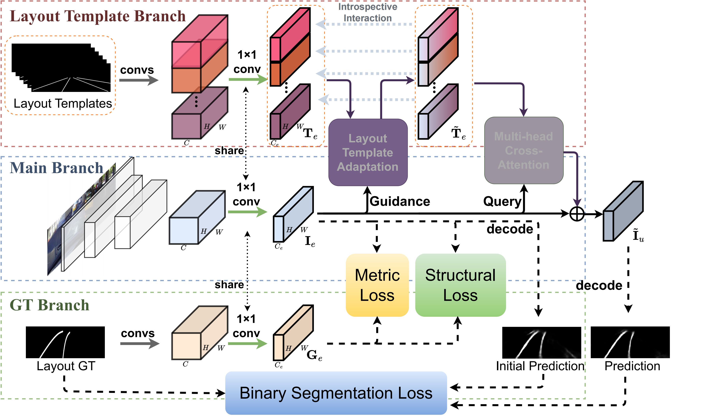
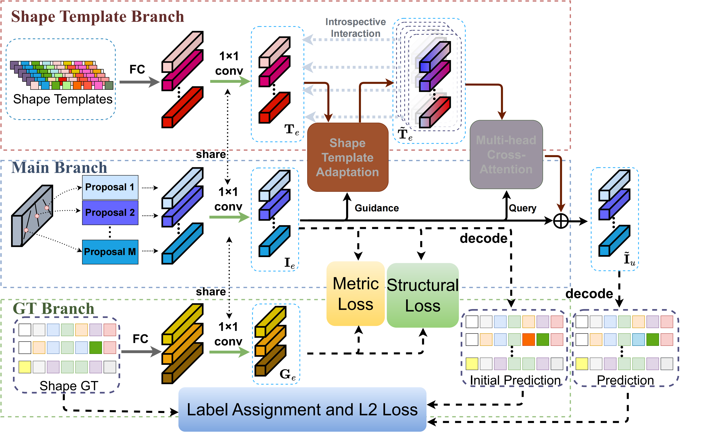

# StructLane
> StructLane: Leveraging Structural Relations for Lane Detection
> 
> (Under Peer Review)
> 
> Linqing Zhao, Wenzhao Zheng, Yunpeng Zhang, Jie Zhou, Jiwen Lu

## Introduction
Accurately detecting the lanes plays a significant role in various autonomous and assistant driving scenarios. It is a highly structured task as lanes in the 3D world are continuous and parallel to each other. While most existing methods focus on how to inject structural priors into the representation of each lane, we propose a StructLane method to further leverage the structural relations among lanes for more accurate and robust lane detection. To achieve this, we explicitly encode the structural relations using a set of relational templates in a learned structural space. We then employ the attention mechanism to enable interactions between templates and image features to incorporate structural relational priors. Our StructLane can be applied to existing lane detection methods as a plug-and-play module to improve their performance. Extensive experiments on the widely used CULane, TuSimple, and LLAMAS datasets demonstrate that StructLane consistently improves the performance of state-of-the-art models across all datasets and backbones. Visualization results also demonstrate the robustness of our StructLane compared with existing methods due to the leverage of structural relations.

## Method
Layout-Specific StructLane

Shape-Specific StructLane

## Results
CULane (F1@75):
| Method                   | ResNet18   | ResNet34    |   ResNet50    | ResNet101    |
| :----------------------- | :----:     | :-----:     |  :-----:      | :-----:      | 
| RESA              | -------    | -------       |   75.30      |  -------      |
| StructLane (RESA) | -------    | -------      |  76.95      |  -------      |
| B´ezierLaneNet              | -------    |  75.57       |   -------      |  -------      |
| StructLane (B´ezierLaneNet) | -------    | 76.96      |  -------      |  -------      |
| CondLaneNet              | 57.42      | 59.39       |  -------      |  61.23       |
| StructLane (CondLaneNet) |  57.59     | 59.87       |  -------      |  61.10       |
| CLRNet                   |  79.58     |  79.73      |  -------      |  80.13       |
| StructLane (CLRNet)      |  80.39     |  80.79      |  -------      |  80.98       |

